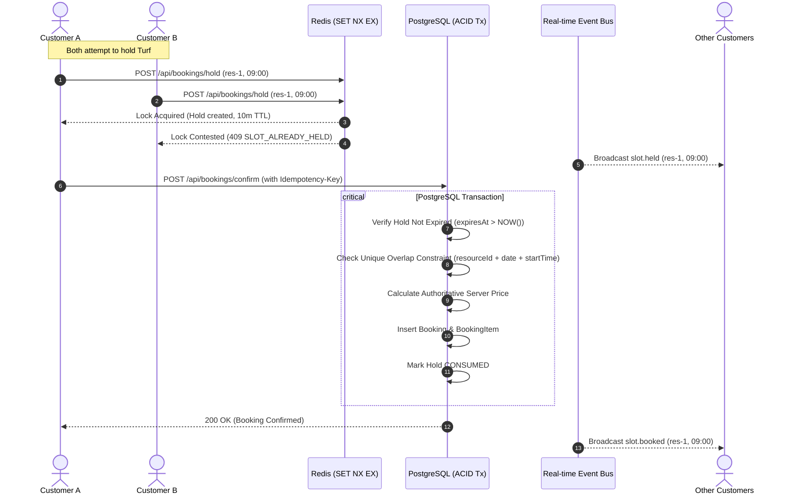

# Booking Engine Architecture & Double-Booking Invariants

## Core Principle
**TWO CUSTOMERS CAN NEVER SUCCESSFULLY BOOK THE SAME RESOURCE + TIME RANGE.**

The Database is the authoritative final source of truth. Redis provides low-latency atomic temporary holds (10-minute TTL), and Server-Sent Events (SSE) propagate real-time inventory updates across connected clients.

---

## Architecture Diagram

---

## The 10 Critical Database Invariants

1. **Overlap Exclusion:** One resource cannot have overlapping confirmed bookings (enforced via database unique constraint on `[resourceId, date, startTime, endTime]`).
2. **Hold Expiry Safety:** An expired hold cannot transition into a confirmed booking.
3. **Verified Payment:** A booking cannot be confirmed without a verified payment record or authorized webhook.
4. **Webhook Idempotency:** A payment webhook event cannot be processed twice (`ProcessedWebhookEvent` table).
5. **Idempotency Key Deduplication:** An `Idempotency-Key` prevents duplicate charges and replays the original confirmation result.
6. **Authoritative Pricing:** Client-submitted prices are never trusted. The backend computes prices from authoritative `Venue` & `VenueResource` rates.
7. **Redis Failure Resilience:** If Redis crashes or fails, PostgreSQL ACID locks still prevent double-booking.
8. **SSE Failure Resilience:** If SSE disconnects, database read queries reflect current authoritative state on next load.
9. **Multi-Slot Atomicity:** Multi-slot bookings are all-or-nothing transactions; either all slots succeed or none are booked.
10. **Multi-Resource Isolation:** Booking one resource (e.g. *Turf #01*) never blocks another resource (*Turf #02*) at the same venue.
