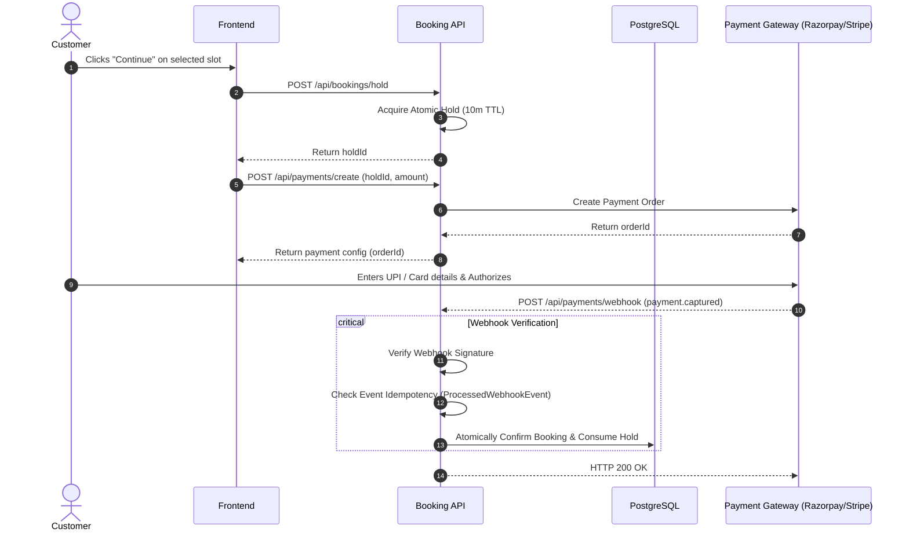

# Decoupled Payment Architecture & Webhook Handling

## Payment Flow

```mermaid
sequenceDiagram
    autonumber
    actor User as Customer
    participant App as Frontend
    participant Server as Booking API
    participant PG as PostgreSQL
    participant Gateway as Payment Gateway (Razorpay/Stripe)

    User->>App: Clicks "Continue" on selected slot
    App->>Server: POST /api/bookings/hold
    Server->>Server: Acquire Atomic Hold (10m TTL)
    Server-->>App: Return holdId

    App->>Server: POST /api/payments/create (holdId, amount)
    Server->>Gateway: Create Payment Order
    Gateway-->>Server: Return orderId
    Server-->>App: Return payment config (orderId)

    User->>Gateway: Enters UPI / Card details & Authorizes
    Gateway-->>Server: POST /api/payments/webhook (payment.captured)
    critical Webhook Verification
        Server->>Server: Verify Webhook Signature
        Server->>Server: Check Event Idempotency (ProcessedWebhookEvent)
        Server->>PG: Atomically Confirm Booking & Consume Hold
    end
    Server-->>Gateway: HTTP 200 OK
```
